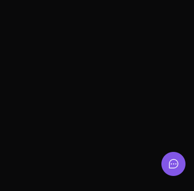

<h1 align="center"> Feedback Widget </h1>
<p align="center">Trilha Impulse do Evento Next Level Week Return da Rockeseat.</p>

<p align="center">
    
    
    <a href="https://www.linkedin.com/in/luanzuffo/" target="_blank">
        
    </a>
</p>

---

<h2>🚀 Projeto</h2>
Um Widget de feedback que permite o usuário enviar um feedback com um texto e uma print que é gerada facilmente, com apenas um clique no botão.



---

<h2>🔧 Tecnologias</h2>

### Web

-   ReactJS
-   TailWindCSS
-   Headlessui
-   Vite
-   Axios

### Backend

-   NodeJS
-   Express
-   Prisma
-   Node Mailer
-   Jest

### Mobile

-   React native
-   Expo
-   Bottom Sheet
-   Axios


---

# Como rodar?

Basta rodar os seguintes comando dentro do terminal

## Iniciando o backend

```
> cd server

> npm install

> npm run dev
```

## Iniciando o backend

```
> cd web

> npm install

> npm run dev
```

## Iniciando o mobile

```
> cd mobile

> npm install

> expo start
```
